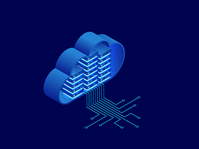

<div align="center">

[](https://git.io/typing-svg)

*Designing technology that works quietly, securely & with a purpose*

[](https://harsh.kavediya.co.in/)
[](https://www.linkedin.com/in/harshkavediya)
[](https://x.com/HarshKavediya)
[](https://leetcode.com/u/harshkavediya/)
[](mailto:kavediyaharsh@gmail.com)
[](https://orcid.org/0009-0002-2259-1537)

</div>

---

## 👨‍💻 About Me

```python
class HarshKavediya:
    def __init__(self):
        self.name = "Harsh Kavediya"
        self.location = "Pune, Maharashtra, India"
        self.education = "B.Tech in E&TC Engineering"
        self.university = "Bharati Vidyapeeth College of Engineering"
        self.interests = [
            "Cloud Computing ☁️",
            "DevOps & Automation 🔄",
            "AI & Machine Learning 🤖",
            "Cybersecurity 🔒",
            "IoT Systems 📡"
        ]
        
    def current_focus(self):
        return {
            "learning": ["Kubernetes", "MCP", "LLM Integration"],
            "building": "Intelligent cloud-native applications",
            "exploring": "AI-driven automation & secure infrastructure"
        }
    
    def philosophy(self):
        return "Building resilient systems that are scalable, secure, and smart"
```

I'm passionate about the intersection of **Cloud**, **DevOps**, and **AI** — where automation meets intelligence. Currently exploring how modern computing technologies can make digital systems smarter, safer, and more efficient. I believe in continuous learning and hands-on experimentation.

---

## 🚀 What I'm Working On

<table>
  <tr>
    <td width="50%">
      
### 🔭 Current Projects
- Implementing **RAG systems**
- Building **AI-powered dashboards**
- Designing **cloud-native applications** 
- Exploring **MCP (Model Context Protocol)** integrations
- Exploring **DevSecOps** with projects
      
    </td>
    <td width="50%">
      
### 🌱 Learning Journey
- Advanced **Kubernetes** orchestration
- **Docker** containers
- **GenAI** application development
- **DevSecOps** practices
- Tinkering with **Linux & Nethunter** (Full Root) device
      
    </td>
  </tr>
</table>

---

## 💼 Professional Experience

### 🔹 Intern @ Jebitech | *July 2025 - Present*
```yaml
Role: Full Stack Developer Intern
Focus: Dashboard Development & Data Analytics
Achievements:
  - Built interactive dashboards using Flask + Dash framework
  - Optimized callback functions: Reduced 10+ callbacks to 1
  - Integrated PostgreSQL for real-time analytics
  - Developed AI chatbot for company information retrieval
Tech Stack: [Python, Flask, PostgreSQL, Dash, Git]
```

### 🔹 Project Intern @ SD IoTecs Pvt Ltd | *June 2025 - July 2025*
```yaml
Role: IoT Development Intern
Focus: Industrial IoT & Real-time Communication
Achievements:
  - Developed responsive interfaces using VB.Net & Node.js
  - Implemented WebSocket for real-time data streaming
  - Secured communication with SSL/TLS protocols
  - Optimized performance for large-scale sensor data
Tech Stack: [VB.Net, Node.js, N3uron, OPCUA, WebSockets]
```

---

## 🛠️ Technology Arsenal

<div align="center">

### ☁️ Cloud & Infrastructure


### 💻 Languages & Frameworks


### 🗄️ Databases & Storage


### 🤖 AI & Machine Learning


### 🔧 Tools & Platforms


</div>

---

## 📊 GitHub Analytics

<div align="center">
  
  
</div>

<div align="center">
  
</div>

<div align="center">
  
</div>

---

## 🎯 Areas of Expertise

<div align="center">

*Where cloud, code, and intelligence converge with security*

</div>

<table align="center">
<tr align="center">
<td width="50%" valign="top">

#### ☁️ Cloud Computing


#### 🔄 DevOps


#### 🤖 AI & ML


</td>
<td width="50%" valign="top">

#### 🔒 Security


#### 💻 Development


</td>
</tr>
</table>

---

## 📚 Certifications & Learning

<table align="center">
  <tr>
    <td align="center" width="50%">
      
🎓 **Google Cybersecurity Professional Certificate**  
*Coursera - Google Career Certificates*  
Dec 2023 - Mar 2024

  </td>
    <td align="center" width="50%">
      
🌐 **Cloud, Cyber & DevOps Specializations**  
*Continuous Learning via Projects & Courses*

  </td>
  </tr>
</table>

---

## 🏆 Achievements & Highlights

<div align="center">

| 🎯 **Metric** | 📈 **Achievement** |
|:---|:---|
| **CGPA** | 7.3 (E&TC Engineering) |
| **Callback Optimization** | 10+ → 1 (90% reduction) |
| **Real-time Systems** | Industrial IoT with WebSockets |
| **AI Projects** | Company Information Chatbot |
| **Security Implementations** | SSL/TLS for IoT Communications |

</div>

---

## 💡 What Drives Me

<table align="center">
  <tr>
    <td align="center" width="33%">
      
      <br><strong>Cloud Architecture</strong>
      <br>Building scalable & cost-optimized solutions
    </td>
    <td align="center" width="33%">
      
      <br><strong>DevOps & Automation</strong>
      <br>Ensuring smooth & consistent delivery
    </td>
    <td align="center" width="33%">
      
      <br><strong>AI & Intelligent Systems</strong>
      <br>Creating applications that learn & adapt
    </td>
  </tr>
</table>

---

## 📫 Let's Connect

<div align="center">

I'm passionate about building **secure, scalable, and intelligent systems** that connect technology with real-world impact. Whether it's a discussion around cloud solutions, AI-driven innovation, or DevOps/SecOps automation — I'm always open to new ideas and collaborations.

### 🤝 Open to Opportunities

**Looking for:** Internships | Full-time Roles | Collaborative Projects  
**Interested in:** Cloud Engineering | AI/ML Engineering | Cybersecurity | DevOps | Full Stack Development

<br>

[](https://harsh.kavediya.co.in/)
[](https://www.linkedin.com/in/harshkavediya)
[](mailto:kavediyaharsh@gmail.com)
[](https://x.com/HarshKavediya)

</div>

---

<div align="center">

### 🌟 "Technology is best when it brings people together and solves real problems" 🌟


**⭐ If you find my projects interesting, feel free to star them!**

</div>

---

<div align="center">
  
</div>